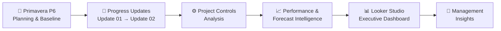
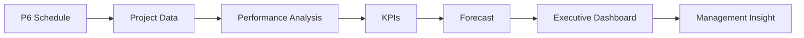

# 🏗️ Hyperscale Data Center — Project Controls Intelligence

> **End-to-end Project Controls portfolio project integrating Primavera P6, Earned Value Management, performance analytics, forecasting, and executive BI reporting.**

This simulated project demonstrates how a detailed project schedule can be transformed into **management-level performance intelligence** across multiple reporting periods.

---

## 🔄 End-to-End Project Controls Workflow



### From schedule development to management decision-making

**PLAN → UPDATE → ANALYZE → FORECAST → REPORT → DECIDE**

---

## 🎯 Project Objective

The objective is to move beyond static schedule reporting and create a Project Controls workflow capable of answering four key questions:

> **Where is the project now?**  
> **How is performance changing?**  
> **Where is the project forecast to finish?**  
> **What requires management attention?**

---

# 01 — PLAN | Primavera P6

The project begins with the development of a detailed **Primavera P6 baseline schedule**.

```text
                    P6 BASELINE
                         │
          ┌──────────────┼──────────────┐
          ▼              ▼              ▼
         WBS         ACTIVITIES       LOGIC
          │              │              │
          ▼              ▼              ▼
      WORK PACKAGES   MILESTONES   RELATIONSHIPS
          │              │              │
          └──────────────┼──────────────┘
                         ▼
                  CRITICAL PATH
                         │
                         ▼
                    TOTAL FLOAT
```

The baseline establishes the original project plan against which future performance can be evaluated.

### Primavera P6 Documentation

📁 **`primavera-p6/`**

- Baseline schedule summary
- WBS and activity structure
- Project milestones
- Schedule logic
- Critical path
- Total float
- Baseline dates

---

# 02 — UPDATE | Multi-Period Reporting

Project performance is tracked across successive reporting periods rather than through a single static snapshot.

```text
        BASELINE
            │
            ▼
      ┌───────────┐
      │ UPDATE 01 │
      └─────┬─────┘
            │
            ▼
      ┌───────────┐
      │ UPDATE 02 │
      └─────┬─────┘
            │
            ▼
    PERFORMANCE TREND
```

Each reporting period captures changes in schedule and project performance, allowing trends and emerging issues to be identified.

---

# 03 — ANALYZE | Project Controls Intelligence

Project data is transformed into measurable cost, schedule, and performance indicators.

```text
                     PROJECT DATA
                          │
          ┌───────────────┼───────────────┐
          ▼               ▼               ▼
        COST           SCHEDULE        PERFORMANCE
          │               │               │
      PV / EV / AC      Critical         CPI
          │            Activities         │
          │               │              SPI
          │            Low Float           │
          │               │               │
          └───────────────┼───────────────┘
                          ▼
                  PROJECT CONTROLS
                     INTELLIGENCE
```

### Key Performance Indicators

| Cost & EVM | Schedule | Forecast |
|---|---|---|
| Planned Value (PV) | Critical Activities | EAC |
| Earned Value (EV) | Low-Float Activities | ETC |
| Actual Cost (AC) | Negative Float | VAC |
| CPI | Forecast Finish | Forecast Scenarios |
| SPI | Schedule Exposure | Management Alerts |

---

# 04 — FORECAST | Looking Forward

The project does not stop at reporting current performance.

Multiple forecasting scenarios are evaluated to understand potential project outcomes.

```text
                 CURRENT PERFORMANCE
                         │
          ┌──────────────┼──────────────┐
          ▼              ▼              ▼
     BUDGET RATE      CPI BASED      CPI + SPI
          │              │              │
          └──────────────┼──────────────┘
                         ▼
                    EAC / ETC / VAC
                         │
                         ▼
                  FORECAST OUTCOME
```

This creates a forward-looking view of project performance and potential cost-at-completion outcomes.

---

# 05 — REPORT | Executive Dashboard

The final reporting layer transforms Project Controls information into an executive-level view using **Looker Studio**.

```text
                   PROJECT CONTROLS DATA
                           │
                           ▼
                    LOOKER STUDIO
                           │
            ┌──────────────┼──────────────┐
            ▼              ▼              ▼
        EXECUTIVE       COST &         SCHEDULE
         OVERVIEW       FORECAST        & RISK
            │              │              │
            └──────────────┼──────────────┘
                           ▼
                    MANAGEMENT VIEW
```

## 📊 Executive Project Controls Dashboard


### Dashboard Views

**Executive Overview**
- BAC, EV and AC
- CPI & SPI
- Forecast EAC
- Cost performance
- Schedule exposure
- Management alerts

**Cost & Forecast**
- EAC
- ETC
- VAC
- Forecast scenarios
- Cost-at-completion analysis

**Schedule & Risk**
- Critical activities
- Low-float activities
- Negative float
- SPI
- Forecast finish
- Schedule exposure

---

# 🧠 From Data to Decision



The objective is not simply to visualize data.

The objective is to transform **schedule and performance data into information that supports project-control decisions.**

---

# 🛠️ Technology Stack

| Project Controls Layer | Technology |
|---|---|
| Planning & Scheduling | **Primavera P6** |
| Earned Value Management | **EVM** |
| Data Processing | **Python / Pandas** |
| Reporting Data Layer | **Google Sheets** |
| Business Intelligence | **Looker Studio** |
| Portfolio & Version Control | **GitHub** |

---

# 📁 Repository Structure

```text
Hyperscale-Data-Center/
│
├── README.md
│
├── primavera-p6/
│   └── baseline-schedule-summary.pdf
│
├── dashboard/
│   ├── README.md
│   ├── 01-executive-overview.png
│   ├── 02-cost-forecast.png
│   └── 03-schedule-risk.png
│
├── notebooks/
│   └── project-controls-analysis.ipynb
│
└── data/
    └── project-controls-data.xlsx
```

---

# 🚀 Project Development

```text
PRIMAVERA P6 BASELINE       ✅
          │
          ▼
MULTI-PERIOD UPDATES        ✅
          │
          ▼
EARNED VALUE ANALYSIS       ✅
          │
          ▼
FORECAST SCENARIOS          ✅
          │
          ▼
EXECUTIVE BI DASHBOARD      ✅
          │
          ▼
PYTHON AUTOMATION           🔄
          │
          ▼
ADVANCED RISK INTELLIGENCE  ⏳
```

The project is continuing to evolve toward deeper **schedule analytics, automation, risk intelligence, and management exception reporting**.

---

## 📌 Disclaimer

This is a **simulated Hyperscale Data Center project** developed as a portfolio case study to demonstrate capabilities in:

**Project Controls • Primavera P6 • Earned Value Management • Schedule Analysis • Forecasting • Data Analytics • BI Reporting • Automation**

It does not represent a live client project.
