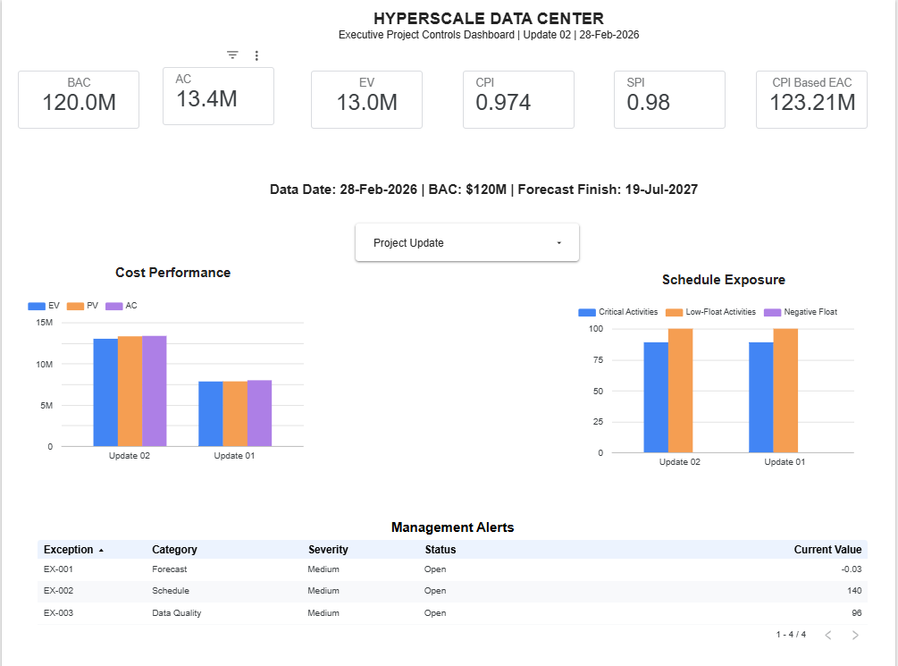
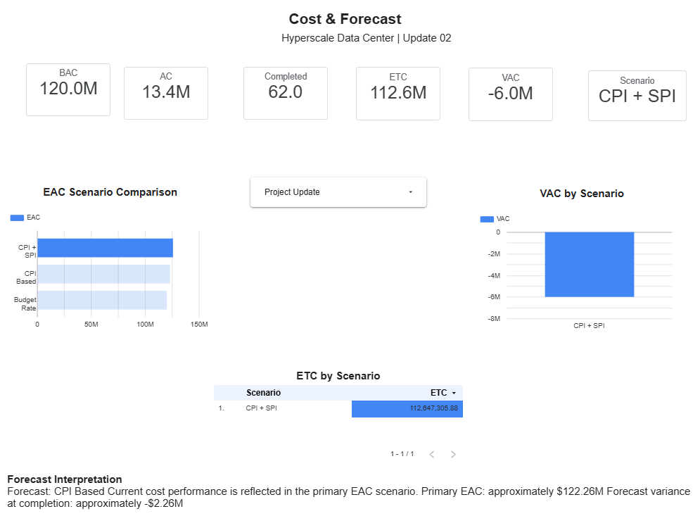
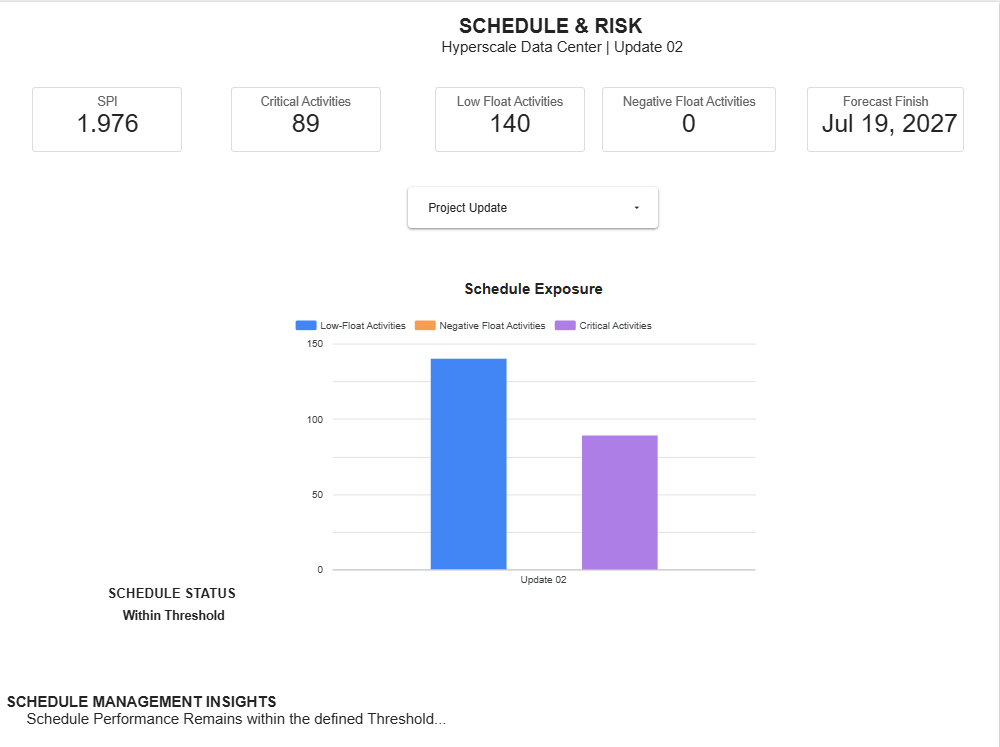

# 📊 Project Controls Dashboards

This folder contains the Looker Studio dashboards developed for the simulated **Hyperscale Data Center Project Controls** portfolio project.

The dashboards transform schedule, earned value, forecast, and risk information into management-level project controls insights.

---

## 01 — Executive Project Controls Overview

Provides an executive view of overall project performance, including:

- Budget at Completion (BAC)
- Earned Value (EV)
- Actual Cost (AC)
- CPI & SPI
- Earned Value trends
- WBS performance
- Critical and low-float exposure
- Management alerts
- Multi-period performance tracking

---

## 02 — Cost & Forecast Intelligence

Focuses on cost performance and forward-looking project forecasts, including:

- Estimate at Completion (EAC)
- Estimate to Complete (ETC)
- Variance at Completion (VAC)
- Forecast scenarios
- Cost variance analysis
- Scenario comparison
- Management interpretation

---

## 03 — Schedule & Risk Intelligence

Provides schedule-focused project controls intelligence, including:

- Schedule Performance Index (SPI)
- Critical activities
- Low-float exposure
- Schedule variance
- Critical-path exposure
- Schedule risk indicators
- Management alerts

---

## 🎯 Dashboard Objective

The objective is not simply to visualize project data.

The dashboards are designed to identify **how project performance changes between reporting periods** and translate those changes into actionable management insight.

---

*Simulated portfolio project developed for Project Controls and analytics demonstration purposes.*
